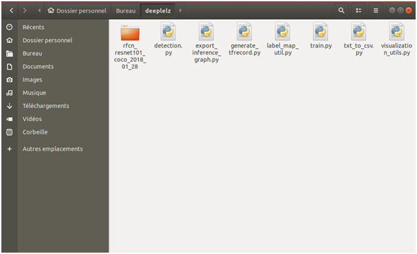
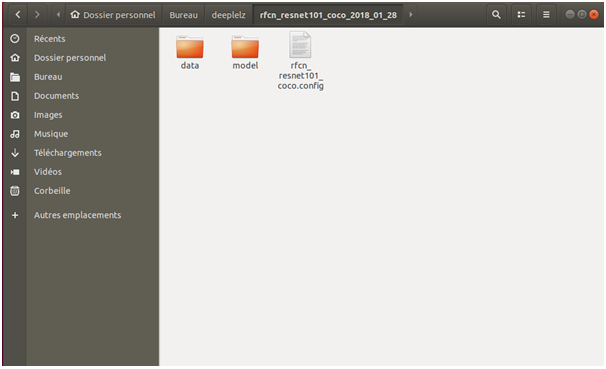
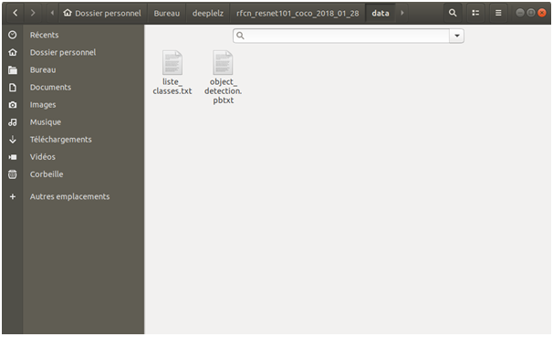
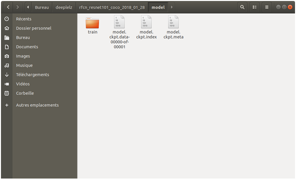

# lelz
petite intro

# Table of contents
* A. <a href='doc/Prerequisites.md'>Prerequisites</a><br>
* B. How to test your network 
* C. How to train and test your network


## A. Prerequisites

1. Having an Ubuntu or MacOS operating system, if you are on Windows install an Ubuntu partition: https://tutorials.ubuntu.com/tutorial/tutorial-create-a-usb-stick-on-ubuntu#0 
https://tutorials.ubuntu.com/tutorial/tutorial-install-ubuntu-desktop#0

2. Install Tensorflow on a virtual environment: https://www.tensorflow.org/install/pip

3. Run the following lines in your virtual environment to install the dependencies:
``` bash
sudo apt install protobuf-compiler (for Ubuntu)
brew install protobuf (for MacOS)
pip install Pillow
pip install pandas
pip install object_detection
pip install matplotlib
pip install tensorboard
pip install opencv-python
```

4. Import `detection.py`, `export_inference_graph.py``generate_tfrecord.py`, `label_map_util.py`, `train.py`, `txt_to_csv.py` and `visualization_utils.py` and put them in a folder of your choice.

5. In that folder, you will place a pre-trained model that you can dowload here: https://github.com/tensorflow/models/blob/master/research/object_detection/g3doc/detection_model_zoo.md.
- For this tutorial we chose "rfcn_resnet101_coco_2018_01_28" as an example, but it works the same for any other model.

6. Dowload this folder https://github.com/tensorflow/models and put it in a place of your choice.
- In `models-master/research/object_detection/samples/configs` search for the .config file corresponding to the model you chose at step A.5. and copy paste it in the folder of this model (`rfcn_resnet101_coco_2018_01_28` for this tutorial).
- In this same folder, create a folder `data` and a folder `model`.
- Move the 3 .ckpt files that are located in `rfcn_resnet101_coco_2018_01_28` to the `model` folder.
- Move or delete the files: `checkpoint`, `frozen_inference_graph.pb` and `pipeline.config`.
- Create a folder `train` in the folder `model`.
- Create and name a .pbtxt file and place it in `data`, in it you will write the following text. You will need to put the names of all your classes in this file if you want to do multi-class object detection. !! begin with id: 1 , not id: 0 !!
```bash
item {
  id: 1
  name: 'class_1'
}
item {
  id: 2
  name: 'class_2'
}
etc..
```
- Create a file class_list.txt and place it in `data`, in it you will write num:class_name for all of your classes. It will look like this:
```bash
1:class_1
2:class_2
etc..
```
You should end up with this in terms of files organization:
<p align="center">
  
</p>
<p align="center">
  
</p>
<p align="center">
  
</p>
<p align="center">
  
</p>
